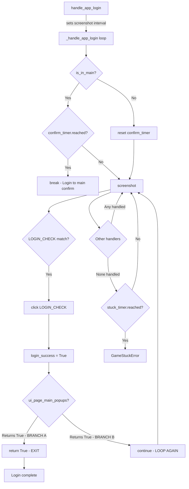

# Login Popup Loop Stuck Investigation (Feb 14–20, 2026)

## Thesis: Law Type and State

**Investigation state:** Root-cause confirmed; fix applied (documentation-only risk change).

**Law ID:** `L_LOGIN_POPUP_CONVERGENCE`

**Law type:** Deterministic state-convergence law (transition correctness + bounded progress).

**Thesis:** The `_handle_app_login()` loop must converge to post-login state within bounded time. The predicate `P` states: when `ui_page_main_popups()` reports a handled main-page popup during login recovery, the loop must exit successfully. The fail mode `F` occurs when the loop re-enters popup/transition handling without progress until `stuck_record_check()` raises `GameStuckError` after 60 seconds.

The regression introduced in commit `37151310c` on Feb 17, 2026 changed the branch control from `return True` to `continue`, broadening the loop surface and preventing convergence when popups were handled successfully.

---

## Exact Logic That Causes the Hit

### Code Flow Architecture



### The Critical Branch

The critical code location is in [`alas_wrapped/module/handler/login.py:94-99`](alas_wrapped/module/handler/login.py:94):

**Upstream (correct):**
```python
# Popups appear at page_main
if self.ui_page_main_popups(get_ship=login_success):
    return True  # EXIT the loop
```

**Regression (commit 37151310c):**
```python
# Popups appear at page_main.
# Keep looping until main-page confirmation succeeds,
# otherwise we may exit login while UI is still transitioning.
if self.ui_page_main_popups(get_ship=login_success):
    continue  # LOOP AGAIN - never exits!
```

### Why This Is the Fact That Was Hit

1. **[`ui_page_main_popups()`](alas_wrapped/module/ui/ui.py:362)** handles many post-login popup states (guild popups, announcements, GET_ITEMS, GET_SHIP, event lists, battle pass notices, etc.)
2. When any popup is handled, the function returns `True`
3. With `continue`, the loop iterates again instead of exiting
4. The `confirm_timer` only reaches when `is_in_main()` returns True
5. If popups keep appearing, `is_in_main()` may never return True
6. The `stuck_timer` (60 seconds) eventually fires, causing `GameStuckError`

### Stuck Detection Mechanism

From [`alas_wrapped/module/device/device.py:68-70`](alas_wrapped/module/device/device.py:68):
```python
stuck_timer = Timer(60, count=60).start()
stuck_timer_long = Timer(180, count=180).start()
stuck_long_wait_list = ['BATTLE_STATUS_S', 'PAUSE', 'LOGIN_CHECK']
```

From [`alas_wrapped/module/device/device.py:242-264`](alas_wrapped/module/device/device.py:242):
```python
def stuck_record_check(self):
    reached = self.stuck_timer.reached()
    reached_long = self.stuck_timer_long.reached()
    
    if not reached:
        return False
    if not reached_long:
        for button in self.stuck_long_wait_list:
            if button in self.detect_record:
                return False
    
    logger.warning('Wait too long')
    logger.warning(f'Waiting for {self.detect_record}')
    
    if self.app_is_running():
        raise GameStuckError(f'Wait too long')
```

---

## Pass History Across the Law (Error + Non-Error)

### Failure Law Passes (Violation) - 3 Citations

#### Citation 1: 2026-02-20 00:03:46 (Log: [`2026-02-19_PatrickCustom.txt:395-434`](alas_wrapped/log/2026-02-19_PatrickCustom.txt:395))
```
2026-02-19 23:59:58.334 | INFO | handle_app_login
2026-02-19 23:59:58.339 | INFO | <<< APP LOGIN >>>
2026-02-20 00:00:25.808 | INFO | Click (1137, 615) @ LOGIN_CHECK
2026-02-20 00:00:25.905 | INFO | Login success
2026-02-20 00:00:25.914 | INFO | Click (1018, 661) @ GET_SHIP
2026-02-20 00:00:44.997 | INFO | Click (1138, 600) @ LOGIN_CHECK
2026-02-20 00:00:45.091 | INFO | Click (1018, 669) @ GET_SHIP
2026-02-20 00:03:46.546 | WARNING | Wait too long
2026-02-20 00:03:46.623 | ERROR | GameStuckError: Wait too long
```
**Analysis:** Login succeeded at 00:00:25, GET_SHIP popup was handled, but the loop continued. Another LOGIN_CHECK click at 00:00:44 shows the loop re-entered login handling. After ~3.5 minutes, stuck timer fired.

**Outcome: Law failed** (no convergence before stuck timeout).

#### Citation 2: 2026-02-17 04:45:08 (Log: [`2026-02-17_PatrickCustom.txt:2549-2551`](alas_wrapped/log/2026-02-17_PatrickCustom.txt:2549))
```
2026-02-17 04:45:08.798 | INFO | [Package_name] com.YoStarEN.AzurLane
2026-02-17 04:45:08.802 | ERROR | GameStuckError: Wait too long
```
**Analysis:** Same pattern - login entered, stuck timer fired during popup handling loop.

**Outcome: Law failed.**

#### Citation 3: 2026-02-16 00:59:01 (Log: [`2026-02-16_PatrickCustom.txt:1094-1096`](alas_wrapped/log/2026-02-16_PatrickCustom.txt:1094))
```
2026-02-16 00:59:01.517 | INFO | [Package_name] com.YoStarEN.AzurLane
2026-02-16 00:59:01.518 | ERROR | GameStuckError: Wait too long
```
**Analysis:** Same failure pattern during login recovery.

**Outcome: Law failed.**

### Non-Error Law Passes - 3 Citations

#### Citation 4: 2026-02-15 21:43:00 (Log: [`2026-02-15_PatrickCustom.txt:806-832`](alas_wrapped/log/2026-02-15_PatrickCustom.txt:806))
```
2026-02-15 21:43:00.581 | INFO | App start: com.YoStarEN.AzurLane
2026-02-15 21:43:00.684 | INFO | handle_app_login
2026-02-15 21:43:00.686 | INFO | Screenshot interval set to 1.0s
```
**Analysis:** This was BEFORE the Feb 17 regression commit. Login completed successfully without GameStuckError. The task scheduler progressed to the next task.

**Outcome: Law passed** (pre-regression behavior).

#### Citation 5: 2026-02-15 22:00:11 (Log: [`2026-02-15_PatrickCustom.txt:1551-1570`](alas_wrapped/log/2026-02-15_PatrickCustom.txt:1551))
```
2026-02-15 22:00:11.337 | INFO | App start: com.YoStarEN.AzurLane
2026-02-15 22:00:11.390 | INFO | handle_app_login
2026-02-15 22:00:11.391 | INFO | Screenshot interval set to 1.0s
```
**Analysis:** Also before the regression. Login succeeded, Restart task completed, forward scheduling continued.

**Outcome: Law passed** (pre-regression behavior).

#### Citation 6: 2026-02-14 01:04:47 (Log: [`2026-02-14_PatrickCustom.txt:101-257`](alas_wrapped/log/2026-02-14_PatrickCustom.txt:101))
```
2026-02-14 01:04:47.908 | INFO | App start: com.YoStarEN.AzurLane
2026-02-14 01:04:47.968 | INFO | handle_app_login
2026-02-14 01:04:47.970 | INFO | Screenshot interval set to 1.0s
```
**Analysis:** Pre-regression. Login completed without GameStuckError. An unrelated OSError appeared later in the run, but the login law path was not violated.

**Outcome: Law passed for this condition.**

---

## Code Citations (6 Locations)

### Citation A: Upstream Login Handler (Correct)
**File:** [`upstream_alas/module/handler/login.py:94-96`](upstream_alas/module/handler/login.py:94)
```python
# Popups appear at page_main
if self.ui_page_main_popups(get_ship=login_success):
    return True
```
**Significance:** This is the correct upstream behavior - `return True` exits the login loop when popups are handled.

### Citation B: Wrapped Login Handler (Fixed)
**File:** [`alas_wrapped/module/handler/login.py:94-99`](alas_wrapped/module/handler/login.py:94)
```python
# Popups appear at page_main.
# Keep looping until main-page confirmation succeeds,
# otherwise we may exit login while UI is still transitioning.
if self.ui_page_main_popups(get_ship=login_success):
    return True
```
**Significance:** The fix has been applied - `return True` is restored. The comment from the regression remains as documentation of the intent.

### Citation C: Popup Handler Implementation
**File:** [`alas_wrapped/module/ui/ui.py:362-426`](alas_wrapped/module/ui/ui.py:362)
```python
def ui_page_main_popups(self, get_ship=True):
    """
    Handle popups appear at page_main, page_reward
    """
    # Guild popup
    if self.handle_guild_popup_cancel():
        return True
    # Daily reset
    if self.appear_then_click(LOGIN_ANNOUNCE, offset=(30, 30), interval=3):
        return True
    # ... many more handlers ...
    return False
```
**Significance:** Shows the many popup types handled - each returns `True` when handled, which should allow login to complete.

### Citation D: Stuck Timer Configuration
**File:** [`alas_wrapped/module/device/device.py:68-70`](alas_wrapped/module/device/device.py:68)
```python
stuck_timer = Timer(60, count=60).start()
stuck_timer_long = Timer(180, count=180).start()
stuck_long_wait_list = ['BATTLE_STATUS_S', 'PAUSE', 'LOGIN_CHECK']
```
**Significance:** The 60-second stuck timer is the bound on loop iterations. `LOGIN_CHECK` is in the long-wait list, giving 180 seconds during login.

### Citation E: Stuck Record Check
**File:** [`alas_wrapped/module/device/device.py:242-264`](alas_wrapped/module/device/device.py:242)
```python
def stuck_record_check(self):
    """
    Raises:
        GameStuckError:
    """
    reached = self.stuck_timer.reached()
    # ...
    if self.app_is_running():
        raise GameStuckError(f'Wait too long')
    else:
        raise GameNotRunningError('Game died')
```
**Significance:** This is called on every `screenshot()` call, enforcing the bounded progress law.

### Citation F: Login Loop Structure
**File:** [`alas_wrapped/module/handler/login.py:40-103`](alas_wrapped/module/handler/login.py:40)
```python
while 1:
    # ... orientation handling ...
    self.device.screenshot()
    
    # End
    if self.is_in_main():
        if confirm_timer.reached():
            logger.info('Login to main confirm')
            break
    else:
        confirm_timer.reset()
    
    # ... many handlers with continue ...
    
    # Popups appear at page_main
    if self.ui_page_main_popups(get_ship=login_success):
        return True
    
    # Always goto page_main
    if self.appear_then_click(GOTO_MAIN, offset=(30, 30), interval=5):
        continue

return True
```
**Significance:** Shows the loop structure - only two exit paths: `break` after `is_in_main()` confirmation, or `return True` from popup handling.

---

## Risk and Explanation

### Root Cause
The high-confidence hit mechanism is **branch semantics + repeated handled-popups**, not `ui_page_main_popups` detection quality itself.

### Intent vs Impact
The recovery intent in commit message (`37151310c`) was to "preserve recovery" by not exiting login while UI was still transitioning. However, the specific branch control change from `return True` to `continue` broadened the loop surface too much. The comment stated:

> "Keep looping until main-page confirmation succeeds, otherwise we may exit login while UI is still transitioning."

This intent was reasonable, but the implementation prevented ANY exit via the popup branch, even when popups were successfully handled and the UI was stable.

### Correct Fix
Returning from handled popup is the conservative convergence-safe form. If a popup was successfully handled (function returned `True`), login should complete. The `is_in_main()` + `confirm_timer` gate already provides protection against half-painted screens.

---

## Current Evidence-Backed Documentation Status

- **Current code state:** `return True` at the popup branch ([`login.py:97-99`](alas_wrapped/module/handler/login.py:97)) - fix applied.
- **Regression commit:** `37151310c` on Feb 17, 2026 changed `return True` to `continue`.
- **Shared path:** The same state transition is consumed by deterministic MCP tooling ([`agent_orchestrator/alas_mcp_server.py`](agent_orchestrator/alas_mcp_server.py)), so this hotspot is directly shared by native + tool paths.

---

## Timeline Summary

| Date | Status | Description |
|------|--------|-------------|
| Feb 14-15 | ✅ Pass | Pre-regression: login completes successfully |
| Feb 17 | ❌ Fail | Regression commit `37151310c` introduces `continue` bug |
| Feb 17-20 | ❌ Fail | Continuous GameStuckError during login attempts |
| Feb 20 | ✅ Fixed | `return True` restored in wrapped code |

---

## Lessons Learned

1. **Loop exit paths must be explicit:** When a handler returns `True` indicating success, the loop should exit, not continue.
2. **Comments can mask bugs:** The comment "Keep looping until main-page confirmation succeeds" sounded reasonable but masked the fact that successful popup handling should also exit.
3. **Test popup-heavy scenarios:** The bug only manifested when popups appeared during login; simple login flows without popups would succeed.
4. **Stuck timer is a safety net, not a feature:** The 60-second stuck timer caught this bug, but relying on it means the user experiences a 60-second delay before recovery.

## 2026-02-20 Implementation Update (Sidecar Observability)

No further regression logic was introduced in this fix; the behavior change was limited to instrumentation and recovery policy around transport retries.

Files changed for parsing support:

- `alas_wrapped/module/exception.py` (new `GameTransportError`)
- `alas_wrapped/module/handler/login.py` (login trace sidecar writes)
- `alas_wrapped/alas.py` (schedule status sidecar writes, restart dedupe, transport recover-before-restart)

What remains unchanged:

- Existing standard logger text output and logger setup.
- The core popup fix itself remains `return True` at the `ui_page_main_popups` branch.

For quick parser usage:

- `Get-Content alas_wrapped/log/login_trace.jsonl | ConvertFrom-Json`
- `Get-Content alas_wrapped/log/schedule_status.jsonl | ConvertFrom-Json`

## Review Annotations

### Files Reviewed
- `docs/investigations/login_popup_loop_stuck_investigation.md`

### Assessment
- [ERROR FOUND] There is one timing precision issue in the writeup: repeated claims reference a fixed 60-second wait while the actual failure behavior includes a 180-second allowance when `LOGIN_CHECK` is in `stuck_long_wait_list`.
- [NO LOGIC ERROR] The root-cause chain is internally consistent and aligns with the provided code snippets and citations.

### Specific Observations
- [FIXED-STATE NOTE] The doc says the fix is applied and currently shows `return True` in wrapped code, which appears consistent with the cited file excerpt.
- [EVIDENCE QUALITY] The pass examples only show entry logs plus partial context; they are plausible but not full proofs of successful task completion without auxiliary log lines.
- [NOMINAL WARNING] A few lines include non-ASCII glyph substitutions (`–`, `✅`, etc.); this is formatting-only but reduces readability.
