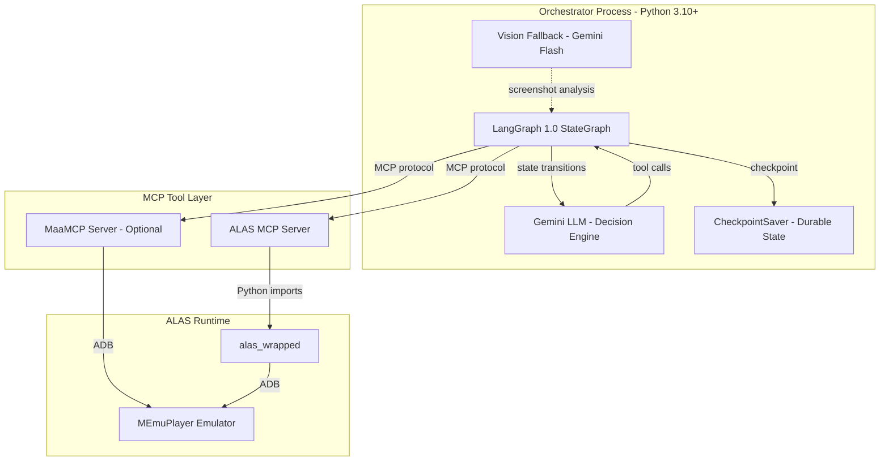
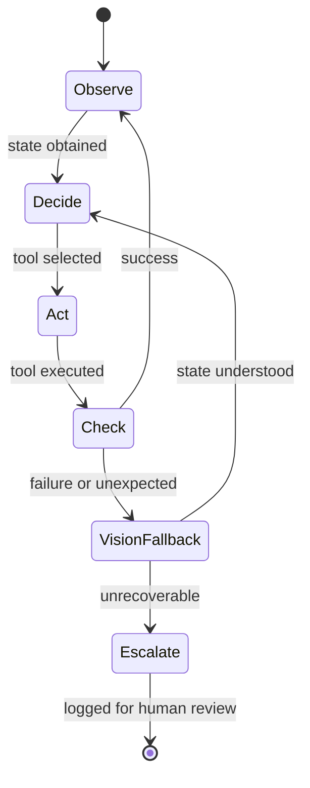

# Durable Agent System Implementation Plan

> **Status**: Draft for Review
> **Created**: 2026-02-17
> **Derived from**: NORTH_STAR.md, ARCHITECTURE.md, ROADMAP.md

## Executive Summary

This plan consolidates research and design for a durable agent system that enables LLM-driven gameplay with autonomous failure recovery. The system uses LangGraph 1.0 for durable execution, MCP for tool access, and a two-tier model hierarchy (Gemini Orchestrator + Gemini Flash Vision).

## Critical Clarification: NORTH_STAR.md Tension

### The Problem

[`NORTH_STAR.md`](../NORTH_STAR.md) contains an apparent contradiction:

| Line | Statement | Interpretation |
|------|-----------|----------------|
| 9 | "LLM usage is reserved for **recovery**" | LLM only activates on failure |
| 14 | "**LLM for recovery only**" | LLM is recovery-only |
| 22 | "Orchestrator: Gemini - **makes decisions, calls tools**, handles recovery" | LLM is always active |

### The Resolution (from ROADMAP.md)

[`ROADMAP.md`](../ROADMAP.md) line 71 clarifies: "**Vision for recovery**: only when tool results are unexpected"

This reveals the intended meaning:
- **LLM (Orchestrator)**: Always active, making decisions, calling tools
- **Vision**: Only used for recovery when tools fail

### Proposed NORTH_STAR.md Clarification

**Current (lines 9-10):**
```markdown
- LLM usage is reserved for **recovery**: stuck states, errors, unexpected situations
```

**Proposed:**
```markdown
- **Vision** usage is reserved for **recovery**: stuck states, errors, unexpected situations
- The LLM Orchestrator is always active, making decisions and calling tools
```

**Current (line 14):**
```markdown
- **LLM for recovery only**: Orchestrator intervenes when tools fail or state is unexpected
```

**Proposed:**
```markdown
- **Vision for recovery only**: When tools fail or state is unexpected, vision model analyzes the screen
```

This aligns NORTH_STAR.md with ROADMAP.md and the actual intended architecture.

---

## Architecture Overview

### High-Level System Design



### Core Gameplay Loop



---

## Implementation Phases

### Phase 1: Foundation (Prerequisites)

**Goal**: Establish the core orchestrator infrastructure

#### 1.1 LangGraph Integration
- [ ] Add `langgraph` and `langchain-google-genai` to [`agent_orchestrator/pyproject.toml`](../../agent_orchestrator/pyproject.toml)
- [ ] Create `agent_orchestrator/game_graph.py` with basic StateGraph
- [ ] Implement `GameState` TypedDict with required fields
- [ ] Create checkpoint saver configuration (SQLite for persistence)

#### 1.2 Gemini LLM Client
- [ ] Create `agent_orchestrator/llm_client.py` with Gemini integration
- [ ] Configure API key management (environment variables)
- [ ] Implement system prompt for gameplay decisions
- [ ] Add tool binding for MCP tools

#### 1.3 MCP Client Integration
- [ ] Create `agent_orchestrator/mcp_client.py` for connecting to MCP servers
- [ ] Implement tool discovery from MCP server
- [ ] Create tool-to-LangChain tool adapter
- [ ] Add connection health monitoring

### Phase 2: Core Gameplay Loop

**Goal**: Implement the observe-decide-act cycle

#### 2.1 Observe Node
- [ ] Implement state observation via `alas_get_current_state`
- [ ] Add fallback to `adb_screenshot` + vision when state unknown
- [ ] Create state parsing and normalization

#### 2.2 Decide Node
- [ ] Implement LLM-based decision making
- [ ] Create tool selection logic
- [ ] Add task queue management
- [ ] Implement priority-based action selection

#### 2.3 Act Node
- [ ] Implement tool execution via MCP
- [ ] Add result parsing and validation
- [ ] Create retry logic with exponential backoff
- [ ] Implement error categorization

#### 2.4 Check Node
- [ ] Implement success/failure detection
- [ ] Add state verification
- [ ] Create unexpected state detection
- [ ] Implement escalation triggers

### Phase 3: Vision Fallback System

**Goal**: Enable vision-based recovery when tools fail

#### 3.1 Screenshot Analysis
- [ ] Integrate `adb_screenshot` tool
- [ ] Create Gemini Flash vision client
- [ ] Implement screen state recognition prompts
- [ ] Add UI element detection

#### 3.2 Recovery Actions
- [ ] Implement common recovery patterns (dismiss popups, return to main)
- [ ] Create recovery action library
- [ ] Add recovery success verification
- [ ] Implement recovery attempt limits

#### 3.3 Escalation System
- [ ] Create escalation event structure
- [ ] Implement detailed context capture
- [ ] Add human-reviewable log format
- [ ] Create escalation notification (optional)

### Phase 4: Durable Execution

**Goal**: Ensure workflow persistence and recovery

#### 4.1 Checkpointing
- [ ] Implement automatic checkpointing after each node
- [ ] Create checkpoint naming convention (timestamp + state hash)
- [ ] Add checkpoint cleanup policy (retain last N)
- [ ] Implement checkpoint inspection tools

#### 4.2 Workflow Resume
- [ ] Implement resume from checkpoint
- [ ] Create state reconstruction logic
- [ ] Add resume validation
- [ ] Implement resume command interface

#### 4.3 Deadlock Detection
- [ ] Implement state progress detection
- [ ] Create stuck state identification
- [ ] Add automatic recovery triggers
- [ ] Implement deadlock logging

### Phase 5: MaaMCP Integration (Optional Enhancement)

**Goal**: Add independent ADB/OCR access layer

#### 5.1 MaaMCP Setup
- [ ] Add MaaMCP as secondary MCP server in `.mcp.json`
- [ ] Configure connection parameters
- [ ] Test basic ADB operations via MaaMCP

#### 5.2 Tool Routing
- [ ] Implement tool routing logic (ALAS vs MaaMCP)
- [ ] Create fallback chain (ALAS primary, MaaMCP backup)
- [ ] Add tool health monitoring

---

## Tool Access Requirements

### Primary MCP Tools (ALAS Server)

| Tool | Purpose | Phase |
|------|---------|-------|
| `alas_get_current_state` | Get current UI page | Phase 2 |
| `alas_goto` | Navigate to target page | Phase 2 |
| `alas_login_ensure_main` | Ensure logged in at main | Phase 2 |
| `alas_list_tools` | Discover available tools | Phase 1 |
| `alas_call_tool` | Call any ALAS tool | Phase 2 |
| `adb_screenshot` | Capture screen for vision | Phase 3 |
| `adb_tap` | Direct tap for recovery | Phase 3 |
| `adb_swipe` | Direct swipe for recovery | Phase 3 |

### Secondary MCP Tools (MaaMCP - Optional)

| Tool | Purpose | Phase |
|------|---------|-------|
| `maa_screenshot` | Independent screenshot | Phase 5 |
| `maa_tap` | Independent tap | Phase 5 |
| `maa_ocr` | OCR without ALAS dependencies | Phase 5 |

---

## Detection Logic

### Failure Detection

```python
def is_failure(result: dict) -> bool:
    """Detect if a tool result indicates failure."""
    return (
        result.get("success") is False
        or result.get("error") is not None
        or result.get("observed_state") != result.get("expected_state")
    )
```

### Stuck State Detection

```python
def is_stuck(state: GameState, history: list[GameState]) -> bool:
    """Detect if the agent is stuck in a loop."""
    if len(history) < 3:
        return False
    
    # Same state for 3+ iterations
    recent = history[-3:]
    if all(s.current_page == state.current_page for s in recent):
        if all(s.last_action == state.last_action for s in recent):
            return True
    
    return False
```

### Deadlock Detection

```python
def is_deadlock(state: GameState, checkpoint: Checkpoint) -> bool:
    """Detect if the workflow is deadlocked."""
    # No progress after multiple attempts
    if state.retry_count >= MAX_RETRIES:
        return True
    
    # Same checkpoint state for too long
    time_in_state = time.now() - checkpoint.timestamp
    if time_in_state > MAX_STATE_DURATION:
        return True
    
    return False
```

---

## Escalation Procedures

### Escalation Levels

| Level | Condition | Action |
|-------|-----------|--------|
| **L1 - Auto Recovery** | Tool failure, state mismatch | Vision fallback, retry |
| **L2 - Workflow Restart** | Stuck state, repeated failures | Resume from last checkpoint |
| **L3 - Human Escalation** | Deadlock, unrecoverable error | Log with full context, halt |

### Escalation Event Structure

```python
@dataclass
class EscalationEvent:
    timestamp: datetime
    level: int  # 1, 2, or 3
    trigger: str  # "tool_failure", "stuck_state", "deadlock"
    context: dict  # Full state at time of escalation
    actions_taken: list[str]  # Recovery attempts
    screenshot_base64: str | None  # Visual context
    checkpoint_id: str  # For potential resume
    suggested_action: str | None  # LLM suggestion for human
```

---

## Interaction Patterns

### Main Loop Pattern

```python
def gameplay_loop(initial_state: GameState) -> None:
    """Main gameplay loop with durable execution."""
    graph = build_game_graph()
    checkpointer = SqliteSaver("checkpoints.db")
    
    while True:
        # Run one iteration
        result = graph.invoke(
            initial_state,
            config={"configurable": {"thread_id": "main"}}
        )
        
        # Check for escalation
        if result.get("escalation"):
            handle_escalation(result["escalation"])
            if result["escalation"].level == 3:
                break  # Halt for human review
        
        # Update state for next iteration
        initial_state = result
```

### Recovery Pattern

```python
def recover_from_failure(state: GameState, error: dict) -> GameState:
    """Recover from a tool failure using vision."""
    # 1. Capture screenshot
    screenshot = mcp_call("adb_screenshot", {})
    
    # 2. Analyze with vision
    analysis = vision_client.analyze(
        screenshot,
        prompt=f"Expected: {state.expected_state}, Error: {error}. What happened?"
    )
    
    # 3. Determine recovery action
    if analysis.suggested_action == "dismiss_popup":
        mcp_call("adb_tap", {"x": analysis.popup_close_x, "y": analysis.popup_close_y})
    elif analysis.suggested_action == "return_main":
        mcp_call("alas_goto", {"page": "page_main"})
    else:
        # Escalate
        return escalate(state, analysis)
    
    return state
```

---

## File Structure

```
agent_orchestrator/
├── pyproject.toml          # Add langgraph, langchain-google-genai
├── alas_mcp_server.py      # Existing - no changes needed
├── game_graph.py           # NEW - LangGraph StateGraph definition
├── llm_client.py           # NEW - Gemini LLM client
├── mcp_client.py           # NEW - MCP client for tool access
├── nodes/
│   ├── __init__.py
│   ├── observe.py          # NEW - State observation node
│   ├── decide.py           # NEW - LLM decision node
│   ├── act.py              # NEW - Tool execution node
│   └── check.py            # NEW - Result verification node
├── recovery/
│   ├── __init__.py
│   ├── vision_fallback.py  # NEW - Vision-based recovery
│   ├── escalation.py       # NEW - Escalation handling
│   └── patterns.py         # NEW - Common recovery patterns
├── checkpoints/
│   └── .gitkeep            # Checkpoint storage directory
└── config/
    └── prompts.py          # NEW - System prompts for LLM
```

---

## Testing Strategy

### Unit Tests
- [ ] Test each node in isolation with mock MCP
- [ ] Test failure detection logic
- [ ] Test stuck state detection
- [ ] Test escalation triggers

### Integration Tests
- [ ] Test full gameplay loop with mock LLM
- [ ] Test checkpoint save/restore
- [ ] Test vision fallback flow
- [ ] Test MaaMCP integration

### End-to-End Tests
- [ ] Test with real MCP server and emulator
- [ ] Test recovery from common failure scenarios
- [ ] Test long-running gameplay sessions

---

## Dependencies

### Python Packages (add to pyproject.toml)

```toml
[project]
dependencies = [
    # Existing dependencies...
    "langgraph>=0.2.0",
    "langchain-google-genai>=2.0.0",
    "langchain-core>=0.3.0",
    "pillow>=10.0.0",  # For image handling
]
```

### Environment Variables

```bash
GOOGLE_API_KEY=your_gemini_api_key
```

---

## Success Criteria

### Phase 1 Complete When
- [ ] LangGraph graph runs with placeholder nodes
- [ ] Gemini LLM responds to basic prompts
- [ ] MCP tools are callable from graph

### Phase 2 Complete When
- [ ] Full observe-decide-act cycle works
- [ ] At least one gameplay task completes end-to-end
- [ ] Tool failures are detected and logged

### Phase 3 Complete When
- [ ] Vision fallback activates on tool failure
- [ ] Common recovery patterns work automatically
- [ ] Escalations are logged with full context

### Phase 4 Complete When
- [ ] Checkpoints persist across restarts
- [ ] Workflow can resume from checkpoint
- [ ] Deadlocks are detected and handled

---

## References

- [NORTH_STAR.md](../NORTH_STAR.md) - Project vision
- [ARCHITECTURE.md](../ARCHITECTURE.md) - System architecture
- [ROADMAP.md](../ROADMAP.md) - Development roadmap
- [agent_tooling/README.md](../agent_tooling/README.md) - MCP tool documentation
- [LangGraph Documentation](https://langchain-ai.github.io/langgraph/)
- [LangChain Google GenAI](https://python.langchain.com/docs/integrations/chat/google_generative_ai/)
