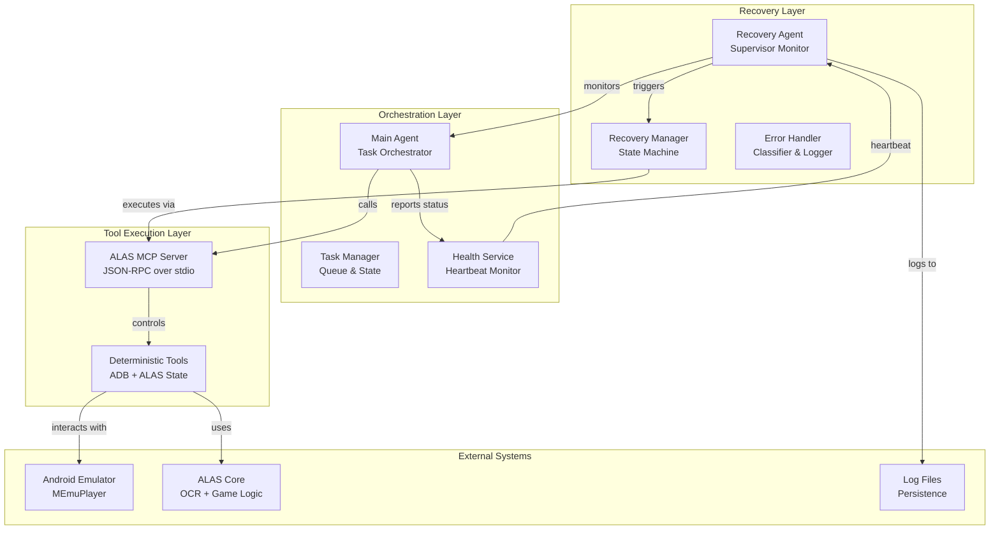
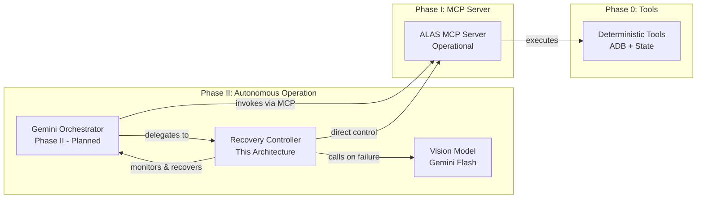
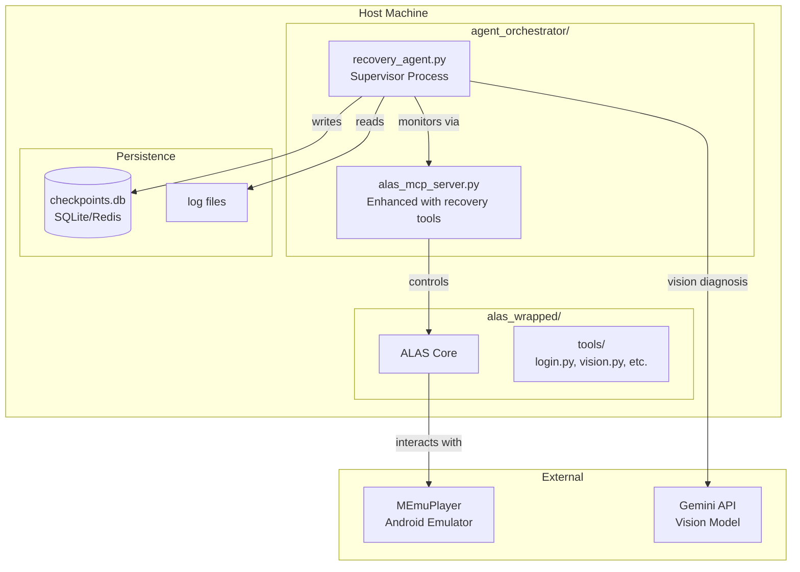
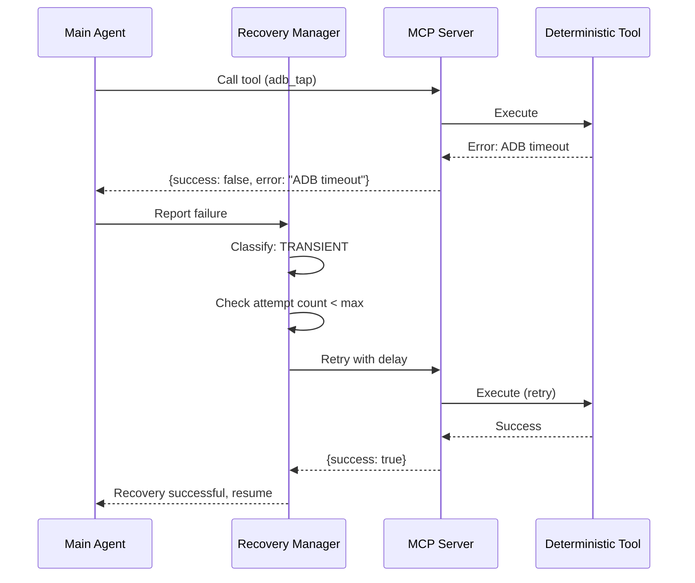
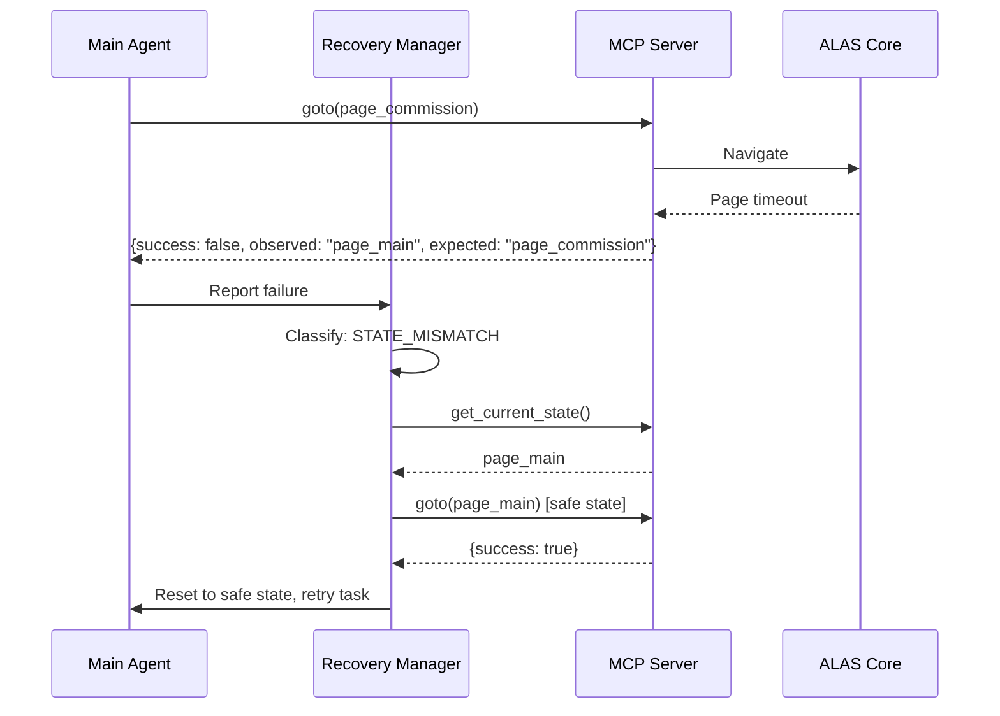
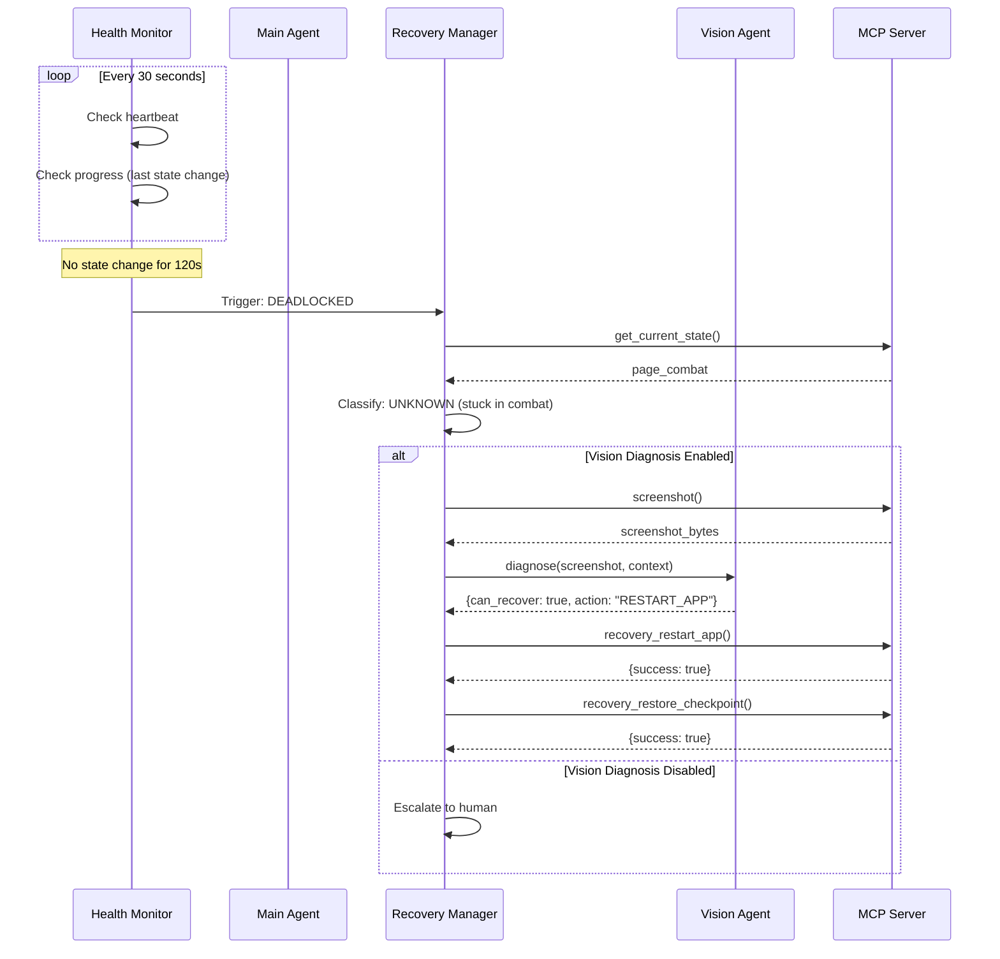
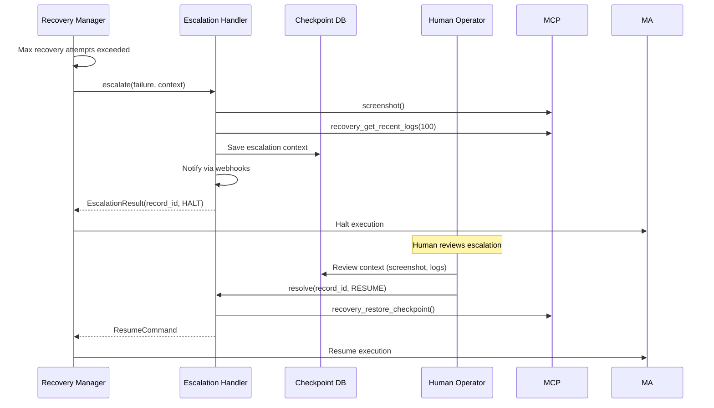

# Durable Agent System Architecture with Autonomous Recovery

## Executive Summary

This document defines a comprehensive architecture for a self-healing agent system that can autonomously detect failures, recover from deadlocks, and maintain operational continuity for the ALAS (Azur Lane Auto Script) automation platform. The recovery agent operates as a supervisor layer above the existing MCP server and deterministic tools, enabling the system to monitor itself and take corrective action when the primary workflow encounters problems.

## System Architecture

### High-Level Component Diagram



### Recovery Agent Position in System



## Core Design Principles

### 1. Deterministic Tools First

The system maintains the NORTH_STAR principle of using deterministic tools for normal operation. The recovery agent only activates when:
- Tools report failure (success=false)
- State transitions don't match expectations
- Deadlock is detected (no progress for N seconds)
- Exceptions propagate to the orchestrator level

### 2. Layered Recovery Strategy

Recovery operates at multiple levels with increasing intervention:

| Level | Action | Trigger | Example |
|-------|--------|---------|---------|
| 0 | Tool Retry | Transient failure | Network timeout on ADB tap |
| 1 | State Reset | Wrong page detected | Navigate to page_main |
| 2 | Workflow Restart | Checkpoint available | Restart from last stable task |
| 3 | Vision Diagnosis | Unknown state | LLM analyzes screenshot |
| 4 | Human Escalation | Unresolvable | Log context, notify operator |

### 3. Full Context on Failure

Every recovery action has access to:
- Recent action history (last N tool calls)
- Current and expected state
- Screenshots (timestamped)
- Log excerpts (errors, warnings)
- System metrics (uptime, task counts)

## Recovery Agent Components

### 1. Health Monitor

The Health Monitor continuously tracks system vitality through multiple channels:

```python
class HealthMonitor:
    """Tracks system health through multiple indicators."""

    def __init__(self):
        self.heartbeat_timeout = 30.0  # seconds
        self.progress_timeout = 120.0   # seconds without state change
        self.error_threshold = 5        # errors in window
        self.error_window = 300.0       # 5 minute window

    def check_heartbeat(self, last_heartbeat: float) -> HealthStatus:
        """Check if main agent is still responding."""
        elapsed = time.monotonic() - last_heartbeat
        if elapsed > self.heartbeat_timeout:
            return HealthStatus.STALLED
        return HealthStatus.HEALTHY

    def check_progress(self, state_history: List[StateSnapshot]) -> HealthStatus:
        """Detect deadlock - no state change despite active execution."""
        if len(state_history) < 2:
            return HealthStatus.HEALTHY

        recent_states = state_history[-10:]  # Last 10 states
        unique_states = set(s.state_name for s in recent_states)

        if len(unique_states) == 1:
            # Stuck in same state
            time_in_state = recent_states[-1].timestamp - recent_states[0].timestamp
            if time_in_state > self.progress_timeout:
                return HealthStatus.DEADLOCKED

        return HealthStatus.HEALTHY

    def check_error_rate(self, errors: List[ErrorEvent]) -> HealthStatus:
        """Detect error storms - too many errors in short window."""
        cutoff = time.monotonic() - self.error_window
        recent_errors = [e for e in errors if e.timestamp > cutoff]

        if len(recent_errors) > self.error_threshold:
            return HealthStatus.DEGRADED

        return HealthStatus.HEALTHY
```

### 2. Error Classifier

Errors are classified to determine appropriate recovery strategy:

```python
class ErrorCategory(Enum):
    TRANSIENT = auto()      # Retry likely to succeed
    STATE_MISMATCH = auto() # Wrong page/UI state
    RESOURCE_UNAVAILABLE = auto()  # Emulator/ADB issue
    LOGIC_ERROR = auto()    # Tool implementation bug
    UNKNOWN = auto()        # Unclassified - needs diagnosis

class ErrorClassifier:
    """Classify errors to determine recovery strategy."""

    TRANSIENT_PATTERNS = [
        r"Connection reset by peer",
        r"ADB server didn't ACK",
        r"Screenshot timeout",
        r"MaaTouch daemon not responding",
    ]

    STATE_MISMATCH_PATTERNS = [
        r"Expected.*but observed",
        r"page_.*not found",
        r"Button.*not appear",
    ]

    RESOURCE_PATTERNS = [
        r"Device not found",
        r"Emulator.*not running",
        r"Failed to connect to ADB",
    ]

    def classify(self, error: str, context: ExecutionContext) -> ErrorCategory:
        """Classify error string into category."""
        error_lower = error.lower()

        for pattern in self.TRANSIENT_PATTERNS:
            if re.search(pattern, error, re.IGNORECASE):
                return ErrorCategory.TRANSIENT

        for pattern in self.STATE_MISMATCH_PATTERNS:
            if re.search(pattern, error, re.IGNORECASE):
                return ErrorCategory.STATE_MISMATCH

        for pattern in self.RESOURCE_PATTERNS:
            if re.search(pattern, error, re.IGNORECASE):
                return ErrorCategory.RESOURCE_UNAVAILABLE

        # Check if this is a recurring error
        if context.error_history:
            similar = [e for e in context.error_history
                      if self._similarity(e.message, error) > 0.8]
            if len(similar) > 2:
                return ErrorCategory.LOGIC_ERROR

        return ErrorCategory.UNKNOWN

    def _similarity(self, a: str, b: str) -> float:
        """Simple string similarity for deduplication."""
        return SequenceMatcher(None, a, b).ratio()
```

### 3. Recovery Manager

The Recovery Manager executes recovery strategies based on error classification:

```python
class RecoveryManager:
    """Executes recovery strategies based on error classification."""

    def __init__(self, mcp_client: MCPClient, vision_agent: Optional[VisionAgent] = None):
        self.mcp = mcp_client
        self.vision = vision_agent
        self.recovery_stats = RecoveryStatistics()
        self.max_recovery_attempts = 3

    async def recover(self, failure: FailureEvent, context: ExecutionContext) -> RecoveryResult:
        """Execute appropriate recovery strategy."""

        # Check if we've tried too many times
        recent_attempts = self._count_recent_attempts(failure, context)
        if recent_attempts >= self.max_recovery_attempts:
            return RecoveryResult(
                success=False,
                action="ESCALATE",
                reason=f"Max recovery attempts ({self.max_recovery_attempts}) exceeded"
            )

        # Route to appropriate handler
        category = failure.error_category

        handlers = {
            ErrorCategory.TRANSIENT: self._handle_transient,
            ErrorCategory.STATE_MISMATCH: self._handle_state_mismatch,
            ErrorCategory.RESOURCE_UNAVAILABLE: self._handle_resource_issue,
            ErrorCategory.LOGIC_ERROR: self._handle_logic_error,
            ErrorCategory.UNKNOWN: self._handle_unknown,
        }

        handler = handlers.get(category, self._handle_unknown)
        return await handler(failure, context)

    async def _handle_transient(self, failure: FailureEvent, context: ExecutionContext) -> RecoveryResult:
        """Retry the failed operation."""
        # Simple retry with exponential backoff
        delay = min(2 ** failure.attempt_count, 30)  # Cap at 30 seconds
        await asyncio.sleep(delay)

        # Retry the exact same operation
        result = await self.mcp.call_tool(failure.tool_name, failure.tool_args)

        return RecoveryResult(
            success=result.get("success", False),
            action="RETRY",
            data=result
        )

    async def _handle_state_mismatch(self, failure: FailureEvent, context: ExecutionContext) -> RecoveryResult:
        """Reset to known good state."""
        # Get current state
        current = await self.mcp.get_current_state()

        # Navigate to expected state or safe state (page_main)
        expected = failure.expected_state or "page_main"

        try:
            await self.mcp.goto(expected)
            return RecoveryResult(
                success=True,
                action="STATE_RESET",
                data={"from": current, "to": expected}
            )
        except Exception as e:
            # If specific state fails, try safe state
            if expected != "page_main":
                try:
                    await self.mcp.goto("page_main")
                    return RecoveryResult(
                        success=True,
                        action="STATE_RESET_SAFE",
                        data={"from": current, "to": "page_main"}
                    )
                except Exception as e2:
                    pass

            return RecoveryResult(
                success=False,
                action="STATE_RESET_FAILED",
                error=str(e)
            )

    async def _handle_resource_issue(self, failure: FailureEvent, context: ExecutionContext) -> RecoveryResult:
        """Handle emulator/ADB connectivity issues."""
        # Try to reconnect to ADB
        for attempt in range(3):
            try:
                # Reconnect ADB
                await self.mcp.reconnect_adb()

                # Verify connection with screenshot
                screenshot = await self.mcp.screenshot()
                if screenshot:
                    return RecoveryResult(
                        success=True,
                        action="ADB_RECONNECT",
                        data={"attempt": attempt + 1}
                    )
            except Exception as e:
                await asyncio.sleep(5)

        return RecoveryResult(
            success=False,
            action="RESOURCE_RECOVERY_FAILED",
            error="Could not reconnect to ADB/emulator"
        )

    async def _handle_unknown(self, failure: FailureEvent, context: ExecutionContext) -> RecoveryResult:
        """Use vision to diagnose unknown failures."""
        if not self.vision:
            return RecoveryResult(
                success=False,
                action="ESCALATE",
                reason="Unknown error and no vision agent available"
            )

        # Capture current state
        screenshot = await self.mcp.screenshot()
        logs = await self._get_recent_logs(context)

        # Ask vision agent to diagnose
        diagnosis = await self.vision.diagnose(
            screenshot=screenshot,
            error_message=failure.error_message,
            action_history=context.recent_actions,
            logs=logs
        )

        if diagnosis.can_recover:
            # Execute recovery action suggested by vision
            result = await self._execute_vision_recovery(diagnosis, context)
            return RecoveryResult(
                success=result.success,
                action=f"VISION_RECOVERY:{diagnosis.recommended_action}",
                data=result.data
            )
        else:
            return RecoveryResult(
                success=False,
                action="ESCALATE",
                reason=diagnosis.reason,
                context={
                    "screenshot": screenshot,
                    "diagnosis": diagnosis.explanation
                }
            )
```

### 4. Vision Diagnosis Agent

The Vision Agent uses LLM with screenshot analysis to diagnose unknown failures:

```python
class VisionDiagnosisAgent:
    """Uses vision-capable LLM to diagnose unknown failures."""

    SYSTEM_PROMPT = """You are a recovery diagnosis agent for a mobile game automation system.

Your task is to analyze the current game state from a screenshot and determine:
1. What is the current game state/page?
2. What went wrong based on the error and action history?
3. Can this be recovered automatically?
4. What specific recovery action should be taken?

Available recovery actions:
- TAP: Tap a specific coordinate
- GOTO: Navigate to a specific page
- WAIT: Wait for a condition
- RESTART_APP: Restart the game app
- ESCALATE: Cannot recover, needs human

Respond in JSON format:
{
    "current_state": "description of what you see",
    "issue_analysis": "what went wrong",
    "can_recover": true/false,
    "recommended_action": "TAP|GOTO|WAIT|RESTART_APP|ESCALATE",
    "action_params": {"coordinates": [x, y]} or {"page": "page_name"} or {},
    "explanation": "why you chose this action"
}"""

    def __init__(self, model: str = "gemini-2.0-flash"):
        self.model = model

    async def diagnose(
        self,
        screenshot: bytes,
        error_message: str,
        action_history: List[ActionRecord],
        logs: List[str]
    ) -> DiagnosisResult:
        """Diagnose failure using vision model."""

        # Build context
        history_str = "\n".join([
            f"- {a.timestamp}: {a.tool_name} -> {a.result}"
            for a in action_history[-5:]  # Last 5 actions
        ])

        log_excerpt = "\n".join(logs[-10:])  # Last 10 log lines

        user_prompt = f"""Error: {error_message}

Recent actions:
{history_str}

Recent logs:
{log_excerpt}

Analyze the attached screenshot and provide your diagnosis."""

        # Call vision model
        response = await self._call_vision_model(
            system=self.SYSTEM_PROMPT,
            user=user_prompt,
            image=screenshot
        )

        # Parse JSON response
        try:
            result = json.loads(response)
            return DiagnosisResult(**result)
        except json.JSONDecodeError:
            # Fallback if model doesn't return valid JSON
            return DiagnosisResult(
                current_state="unknown",
                issue_analysis="Failed to parse vision response",
                can_recover=False,
                recommended_action="ESCALATE",
                explanation=f"Vision model response: {response[:200]}"
            )
```

## State Persistence and Checkpoints

### Checkpoint System

The system maintains checkpoints for recovery at key boundaries:

```python
@dataclass
class Checkpoint:
    """A snapshot of system state at a specific point in time."""
    id: str                          # Unique checkpoint ID
    timestamp: datetime
    thread_id: str                   # For parallel workflows

    # State
    current_page: str
    task_queue: List[Task]
    completed_tasks: List[Task]
    current_task: Optional[Task]

    # Context
    game_state: Dict[str, Any]       # ALAS-specific state
    inventory_cache: Dict[str, int]  # Cached inventory counts

    # Metadata
    checkpoint_type: CheckpointType  # MANUAL, AUTO, RECOVERY
    parent_checkpoint: Optional[str] # For branching

class CheckpointManager:
    """Manages checkpoint persistence for recovery."""

    def __init__(self, storage: CheckpointStorage):
        self.storage = storage
        self.auto_checkpoint_interval = 300  # 5 minutes
        self.checkpoint_on_task_complete = True

    async def create_checkpoint(
        self,
        context: ExecutionContext,
        checkpoint_type: CheckpointType = CheckpointType.AUTO
    ) -> Checkpoint:
        """Create a new checkpoint."""
        checkpoint = Checkpoint(
            id=str(uuid.uuid4()),
            timestamp=datetime.utcnow(),
            thread_id=context.thread_id,
            current_page=context.current_page,
            task_queue=list(context.task_queue),
            completed_tasks=list(context.completed_tasks),
            current_task=context.current_task,
            game_state=await self._capture_game_state(context),
            checkpoint_type=checkpoint_type
        )

        await self.storage.save(checkpoint)
        return checkpoint

    async def restore_checkpoint(self, checkpoint_id: str) -> ExecutionContext:
        """Restore system state from checkpoint."""
        checkpoint = await self.storage.load(checkpoint_id)

        context = ExecutionContext(
            thread_id=checkpoint.thread_id,
            current_page=checkpoint.current_page,
            task_queue=deque(checkpoint.task_queue),
            completed_tasks=checkpoint.completed_tasks,
            current_task=checkpoint.current_task,
            game_state=checkpoint.game_state
        )

        # Restore game state via MCP
        if checkpoint.current_page:
            await self.mcp.goto(checkpoint.current_page)

        return context

    async def get_latest_stable_checkpoint(self, thread_id: str) -> Optional[Checkpoint]:
        """Get the most recent checkpoint that completed a task."""
        checkpoints = await self.storage.list_checkpoints(
            thread_id=thread_id,
            types=[CheckpointType.AUTO, CheckpointType.MANUAL],
            limit=10
        )

        # Find checkpoint after last completed task
        for cp in reversed(checkpoints):
            if cp.completed_tasks:
                return cp

        return checkpoints[0] if checkpoints else None
```

### Storage Backends

```python
class CheckpointStorage(ABC):
    """Abstract base for checkpoint storage."""

    @abstractmethod
    async def save(self, checkpoint: Checkpoint): ...

    @abstractmethod
    async def load(self, checkpoint_id: str) -> Checkpoint: ...

    @abstractmethod
    async def list_checkpoints(self, thread_id: str, **filters) -> List[Checkpoint]: ...

class SQLiteCheckpointStorage(CheckpointStorage):
    """Local SQLite storage for development/single-node."""
    # Implementation for local SQLite

class RedisCheckpointStorage(CheckpointStorage):
    """Redis storage for distributed/multi-node."""
    # Implementation for Redis
```

## Escalation Procedures

### Escalation Levels

| Level | Condition | Action | Notification |
|-------|-----------|--------|--------------|
| 1 | Recovery succeeded | Log, continue | None |
| 2 | Recovery failed, can retry | Queue retry | Log warning |
| 3 | Max retries exceeded | Escalate to human | Log error, notify |
| 4 | Critical system failure | Stop all, preserve state | Immediate alert |

### Escalation Handler

```python
class EscalationHandler:
    """Handles human escalation for unresolvable failures."""

    def __init__(self):
        self.escalation_log: List[EscalationRecord] = []
        self.notification_hooks: List[Callable] = []

    async def escalate(self, failure: FailureEvent, context: ExecutionContext) -> EscalationResult:
        """Escalate to human operator."""

        # Capture full context
        escalation_context = EscalationContext(
            timestamp=datetime.utcnow(),
            failure=failure,
            action_history=context.recent_actions,
            current_state=context.current_page,
            screenshot=await self._capture_screenshot(),
            logs=await self._get_log_excerpt(lines=100),
            checkpoint_id=context.last_checkpoint_id
        )

        # Persist escalation record
        record = EscalationRecord(
            id=str(uuid.uuid4()),
            context=escalation_context,
            status=EscalationStatus.PENDING
        )
        self.escalation_log.append(record)

        # Notify via hooks
        for hook in self.notification_hooks:
            try:
                await hook(record)
            except Exception as e:
                logger.error(f"Notification hook failed: {e}")

        # Halt execution
        return EscalationResult(
            record_id=record.id,
            action="HALT",
            message="Execution halted pending human intervention"
        )

    def on_resolution(self, record_id: str, resolution: ResolutionAction):
        """Called when human resolves escalation."""
        record = self._find_record(record_id)
        record.status = EscalationStatus.RESOLVED
        record.resolution = resolution

        if resolution.action == "RESUME":
            # Resume from checkpoint
            return ResumeCommand(
                checkpoint_id=record.context.checkpoint_id,
                skip_current_task=resolution.skip_current_task
            )
        elif resolution.action == "ABORT":
            # Abort current workflow
            return AbortCommand(reason=resolution.reason)
```

## MCP Tool Extensions for Recovery

### Recovery-Related MCP Tools

The recovery agent requires additional MCP tools for full system control:

```python
@mcp.tool()
def recovery_get_system_status() -> Dict[str, Any]:
    """Get comprehensive system status for health monitoring.

    Returns:
        {
            "healthy": bool,
            "current_page": str,
            "current_task": str | None,
            "adb_connected": bool,
            "emulator_responding": bool,
            "last_activity": timestamp,
            "errors_in_last_5min": int
        }
    """

@mcp.tool()
def recovery_restart_adb() -> Dict[str, Any]:
    """Restart ADB connection to recover from connectivity issues.

    Returns:
        {
            "success": bool,
            "error": str | None,
            "time_to_reconnect_ms": int
        }
    """

@mcp.tool()
def recovery_capture_checkpoint(checkpoint_type: str = "manual") -> Dict[str, Any]:
    """Capture current state as a recovery checkpoint.

    Args:
        checkpoint_type: "manual", "auto", or "recovery"

    Returns:
        {
            "success": bool,
            "checkpoint_id": str | None,
            "error": str | None
        }
    """

@mcp.tool()
def recovery_restore_checkpoint(checkpoint_id: str) -> Dict[str, Any]:
    """Restore system state from a checkpoint.

    Args:
        checkpoint_id: ID of checkpoint to restore

    Returns:
        {
            "success": bool,
            "restored_page": str | None,
            "error": str | None
        }
    """

@mcp.tool()
def recovery_get_recent_logs(lines: int = 50, level: str = "WARNING") -> List[Dict]:
    """Get recent log entries for diagnosis.

    Args:
        lines: Number of log lines to retrieve
        level: Minimum log level (DEBUG, INFO, WARNING, ERROR)

    Returns:
        List of log entries with timestamp, level, message
    """

@mcp.tool()
def recovery_force_stop_app(package: str = "com.YoStarEN.AzurLane") -> Dict[str, Any]:
    """Force stop the game app for clean restart.

    Args:
        package: Package name of the app

    Returns:
        {
            "success": bool,
            "error": str | None
        }
    """

@mcp.tool()
def recovery_restart_app(package: str = "com.YoStarEN.AzurLane") -> Dict[str, Any]:
    """Restart the game app from scratch.

    Args:
        package: Package name of the app

    Returns:
        {
            "success": bool,
            "error": str | None,
            "time_to_main_ms": int
        }
    """
```

## Integration with Existing System

### Deployment Architecture



### Process Model

1. **MCP Server**: Runs as persistent process (existing)
2. **Recovery Agent**: Can run as:
   - Thread within MCP server (simpler)
   - Separate process with IPC (more robust)
   - External supervisor via MCP client (most flexible)

### Configuration

```yaml
# recovery_config.yaml
recovery:
  enabled: true

  health_monitor:
    heartbeat_timeout_seconds: 30
    progress_timeout_seconds: 120
    error_threshold: 5
    error_window_seconds: 300

  recovery_manager:
    max_recovery_attempts: 3
    enable_vision_diagnosis: true
    vision_model: "gemini-2.0-flash"

  checkpointing:
    enabled: true
    storage_backend: "sqlite"  # or "redis"
    sqlite_path: "./checkpoints.db"
    auto_checkpoint_interval_seconds: 300
    checkpoint_on_task_complete: true
    max_checkpoints: 100

  escalation:
    enabled: true
    notification_webhooks:
      - "https://hooks.slack.com/services/..."
    log_escalation_context: true
    halt_on_escalation: true

  retry_policy:
    transient:
      max_retries: 3
      backoff_base_seconds: 2
      backoff_max_seconds: 30
    state_mismatch:
      max_retries: 2
      reset_to_safe_state: true
```

## Recovery Workflows

### Workflow 1: Transient Failure Recovery



### Workflow 2: State Mismatch Recovery



### Workflow 3: Deadlock Detection and Recovery



### Workflow 4: Escalation to Human



## Implementation Roadmap

### Phase 1: Foundation (Core Recovery)

- [ ] Implement Health Monitor with heartbeat and deadlock detection
- [ ] Implement Error Classifier with pattern matching
- [ ] Implement Recovery Manager with transient and state mismatch handlers
- [ ] Add recovery tools to MCP server (restart_adb, get_status)
- [ ] Implement basic checkpointing (SQLite storage)
- [ ] Create recovery configuration schema
- [ ] Write unit tests for recovery components

### Phase 2: Vision Integration

- [ ] Implement Vision Diagnosis Agent
- [ ] Integrate with Gemini Flash API
- [ ] Add vision-based recovery handlers
- [ ] Create screenshot analysis prompts
- [ ] Test vision diagnosis on common failure scenarios
- [ ] Implement confidence scoring for vision decisions

### Phase 3: Persistence and Durability

- [ ] Implement full checkpoint/restore system
- [ ] Add Redis backend option for distributed deployments
- [ ] Implement checkpoint pruning and management
- [ ] Add state validation after restore
- [ ] Test recovery from various checkpoint states
- [ ] Implement automatic checkpointing at task boundaries

### Phase 4: Escalation and Observability

- [ ] Implement Escalation Handler with webhook support
- [ ] Create escalation review UI/dashboard
- [ ] Add comprehensive metrics and logging
- [ ] Create recovery dashboards and alerts
- [ ] Write runbooks for common recovery scenarios
- [ ] Document escalation procedures

### Phase 5: Integration and Hardening

- [ ] Integrate recovery agent with main orchestrator
- [ ] Add graceful degradation modes
- [ ] Implement circuit breaker patterns
- [ ] Load test recovery under various failure modes
- [ ] Chaos engineering: inject failures and verify recovery
- [ ] Production readiness review

## Success Metrics

| Metric | Target | Measurement |
|--------|--------|-------------|
| Recovery success rate | >90% | % of failures recovered without human |
| Mean time to recovery | <60s | From failure detection to resolution |
| False positive rate | <5% | Unnecessary recovery attempts |
| Escalation rate | <2% | % of failures requiring human |
| Deadlock detection time | <10s | Time to detect stuck state |
| Checkpoint overhead | <100ms | Time to create checkpoint |

## Risk Assessment

| Risk | Likelihood | Impact | Mitigation |
|------|------------|--------|------------|
| Recovery makes things worse | Medium | High | Conservative recovery, extensive testing, human escalation |
| Vision diagnosis hallucinates | Low | Medium | Confidence thresholds, multiple samples |
| Checkpoint corruption | Low | High | Validation on restore, multiple checkpoint versions |
| Recovery agent itself fails | Low | High | Separate process, watchdog, fallback to existing behavior |
| Performance degradation | Medium | Low | Async monitoring, configurable intervals |

## Appendix: External Research Summary

### Key Patterns from Industry Research

1. **Supervisor Pattern**: The recovery agent follows the established supervisor pattern from Erlang/OTP and modern AI agent frameworks, where a supervisor monitors workers and restarts them on failure.

2. **LangGraph Checkpointing**: The checkpoint system is modeled after LangGraph's persistence layer, using the same concepts of threads and checkpoints for durable execution.

3. **Self-Healing Systems**: Research from 2025 on self-healing AI systems emphasizes:
   - Detection before diagnosis
   - Conservative recovery actions
   - Human escalation for uncertainty
   - Full context preservation

4. **Multi-Agent Failure Recovery**: Industry best practices for multi-agent systems include:
   - Health monitoring at multiple levels
   - Error classification for targeted recovery
   - State persistence for rollback
   - Graceful degradation rather than hard failure

5. **Vision for Recovery**: Using vision models for error diagnosis is an emerging pattern that provides:
   - Better understanding of UI state
   - Ability to recover from unknown states
   - Reduced need for explicit error handling

## References

- [NORTH_STAR.md](../NORTH_STAR.md) - Project vision and principles
- [ARCHITECTURE.md](../ARCHITECTURE.md) - System architecture overview
- [ROADMAP.md](../ROADMAP.md) - Implementation phasing
- [AGENTS.md](../../AGENTS.md) - Agent behavior standards
- [docs/agent_orchestration/README.md](../agent_orchestration/README.md) - Agent orchestration design
- [docs/agent_tooling/README.md](../agent_tooling/README.md) - MCP tool design

---

*Document Status: Draft - Ready for Review*
*Last Updated: 2026-02-17*
