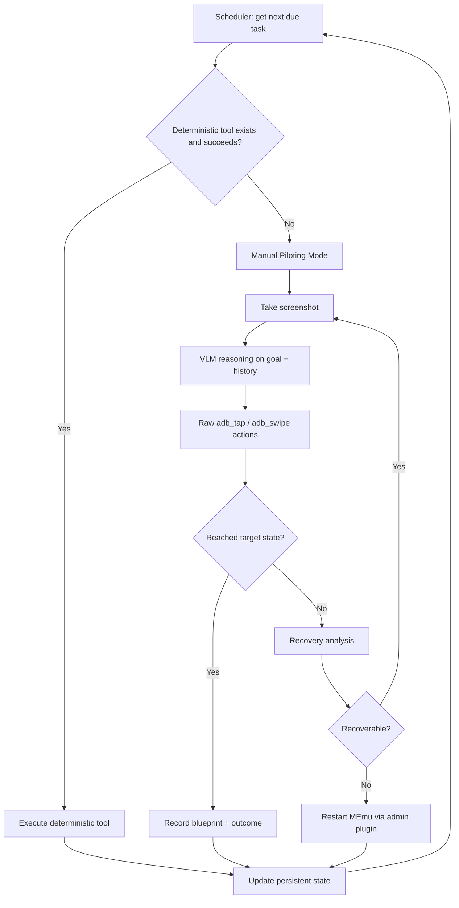
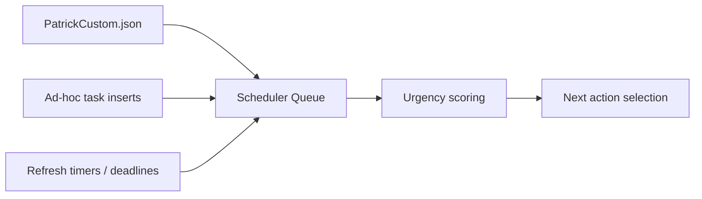
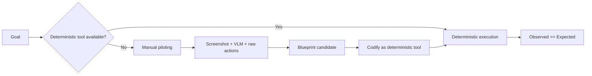
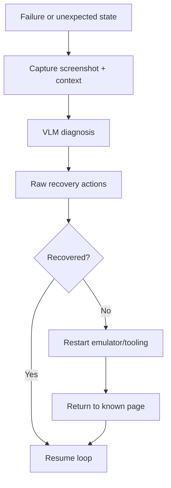
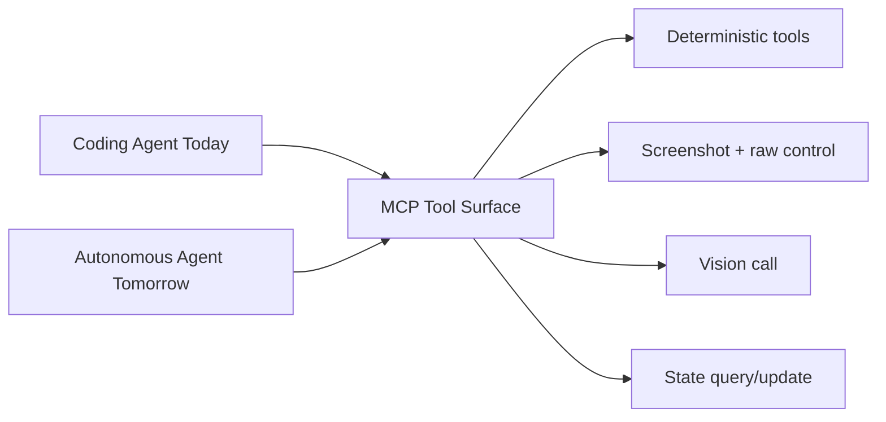

# Permanent Operating Loop Visualization

## Slide 1: System Intent

- One permanent loop for both build-time and autonomous runtime.
- Deterministic tools are preferred hot path.
- Vision/manual mode is permanent fallback and tool-growth engine.
- Error recovery always includes restart fallback to known-good state.

## Slide 2: End-to-End Loop

## Slide 3: Scheduler + Priority Model

## Slide 4: Deterministic vs Manual Paths

## Slide 5: Recovery Ladder

## Slide 6: Single Harness Rule

## Slide 7: Build Order (TDD-Focused)

1. Scheduler + persistent state query/update.
2. Deterministic wrappers for most frequent tasks.
3. Manual piloting + blueprint recording.
4. Recovery ladder with restart path.
5. Autonomous continuous loop using same harness.

