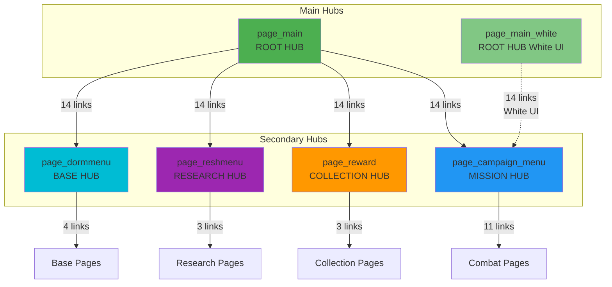
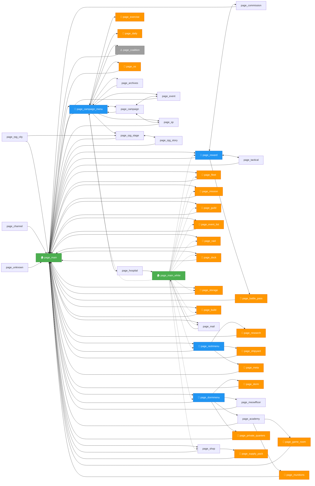

# ALAS State Machine Visualization

> **Generated**: 2026-02-17  
> **Source**: Extracted from `module/ui/page.py`  
> **Total States**: 43 pages  
> **Total Transitions**: 98 active edges

---

## Overview

The ALAS bot uses a **visual state machine** where:
- **States** = UI pages (screens in the game)
- **Transitions** = Button clicks that navigate between pages
- **State Detection** = Visual matching of UI elements (check buttons)
- **Navigation** = A* pathfinding through the page graph

---

## High-Level Architecture



---

## Complete State Machine Graph

### Legend
- 🏠 = Root hub page
- 🎯 = Secondary hub page  
- 📄 = Leaf page (dead-end, only GOTO_MAIN)
- ⚠️ = Disabled/commented variants exist



---

## Detailed Transition Table

### page_main (Root Hub) 🏠

| From | To | Via Button | Notes |
|------|-----|-----------|-------|
| page_main | page_campaign_menu | MAIN_GOTO_CAMPAIGN | Main navigation hub |
| page_main | page_fleet | MAIN_GOTO_FLEET | Fleet management |
| page_main | page_reward | MAIN_GOTO_REWARD | Collection hub |
| page_main | page_mission | MAIN_GOTO_MISSION | Mission list |
| page_main | page_guild | MAIN_GOTO_GUILD | Guild operations |
| page_main | page_event_list | MAIN_GOTO_EVENT_LIST | Event overview |
| page_main | page_raid | MAIN_GOTO_RAID | Raid battles |
| page_main | page_dock | MAIN_GOTO_DOCK | Ship dock |
| page_main | page_storage | MAIN_GOTO_STORAGE | Item storage |
| page_main | page_reshmenu | MAIN_GOTO_RESHMENU | Research hub |
| page_main | page_dormmenu | MAIN_GOTO_DORMMENU | Base/dorm hub |
| page_main | page_shop | MAIN_GOTO_SHOP | Shop |
| page_main | page_build | MAIN_GOTO_BUILD | Ship construction |
| page_main | page_mail | MAIL_ENTER | Mail/inbox |

### page_main_white (White UI Variant) 🏠

All same transitions as `page_main`, using `_WHITE` button variants.

### page_campaign_menu (Mission Hub) 🎯

| From | To | Via Button | Notes |
|------|-----|-----------|-------|
| page_campaign_menu | page_campaign | CAMPAIGN_MENU_GOTO_CAMPAIGN | Main story |
| page_campaign_menu | page_exercise | CAMPAIGN_MENU_GOTO_EXERCISE | PvP |
| page_campaign_menu | page_daily | CAMPAIGN_MENU_GOTO_DAILY | Daily missions |
| page_campaign_menu | page_event | CAMPAIGN_MENU_GOTO_EVENT | Event stages |
| page_campaign_menu | page_sp | CAMPAIGN_MENU_GOTO_EVENT | Special ops |
| page_campaign_menu | page_coalition | CAMPAIGN_MENU_GOTO_EVENT | Coalition event |
| page_campaign_menu | page_os | CAMPAIGN_MENU_GOTO_OS | Operation Siren |
| page_campaign_menu | page_archives | CAMPAIGN_MENU_GOTO_WAR_ARCHIVES | War Archives |
| page_campaign_menu | page_rpg_stage | CAMPAIGN_MENU_GOTO_EVENT | RPG event |
| page_campaign_menu | page_hospital | CAMPAIGN_MENU_GOTO_EVENT | Hospital event |
| page_campaign_menu | page_main | GOTO_MAIN | Back to main |

### page_campaign

| From | To | Via Button | Notes |
|------|-----|-----------|-------|
| page_campaign | page_campaign_menu | BACK_ARROW | ← Back |
| page_campaign | page_event | CAMPAIGN_GOTO_EVENT | Quick nav to event |
| page_campaign | page_sp | CAMPAIGN_GOTO_EVENT | Quick nav to SP |
| page_campaign | page_main | GOTO_MAIN | Home |

### page_reward (Collection Hub) 🎯

| From | To | Via Button | Notes |
|------|-----|-----------|-------|
| page_reward | page_commission | REWARD_GOTO_COMMISSION | Commission dispatch |
| page_reward | page_tactical | REWARD_GOTO_TACTICAL | Tactical class |
| page_reward | page_battle_pass | REWARD_GOTO_BATTLE_PASS | Battle pass |
| page_reward | page_main | REWARD_GOTO_MAIN | Home |

### page_reshmenu (Research Hub) 🎯

| From | To | Via Button | Notes |
|------|-----|-----------|-------|
| page_reshmenu | page_research | RESHMENU_GOTO_RESEARCH | Research projects |
| page_reshmenu | page_shipyard | RESHMENU_GOTO_SHIPYARD | Ship development |
| page_reshmenu | page_meta | RESHMENU_GOTO_META | META ships |
| page_reshmenu | page_main | GOTO_MAIN | Home |

### page_dormmenu (Base Hub) 🎯

| From | To | Via Button | Notes |
|------|-----|-----------|-------|
| page_dormmenu | page_dorm | DORMMENU_GOTO_DORM | Dormitory |
| page_dormmenu | page_meowfficer | DORMMENU_GOTO_MEOWFFICER | Meowfficer |
| page_dormmenu | page_academy | DORMMENU_GOTO_ACADEMY | Naval Academy |
| page_dormmenu | page_private_quarters | DORMMENU_GOTO_PRIVATE_QUARTERS | Private quarters |
| page_dormmenu | page_main | DORMMENU_GOTO_MAIN | Home |

### page_academy

| From | To | Via Button | Notes |
|------|-----|-----------|-------|
| page_academy | page_game_room | ACADEMY_GOTO_GAME_ROOM | Mini-games |
| page_academy | page_munitions | ACADEMY_GOTO_MUNITIONS | Munitions shop |
| page_academy | page_main | GOTO_MAIN | Home |

### page_shop

| From | To | Via Button | Notes |
|------|-----|-----------|-------|
| page_shop | page_supply_pack | SHOP_GOTO_SUPPLY_PACK | Supply packs |
| page_shop | page_main | GOTO_MAIN | Home |
| ~~page_shop~~ | ~~page_munitions~~ | ~~SHOP_GOTO_MUNITIONS~~ | DISABLED |

### RPG Event Pages

| From | To | Via Button | Notes |
|------|-----|-----------|-------|
| page_rpg_stage | page_rpg_story | RPG_GOTO_STORY | Story mode |
| page_rpg_stage | page_main | RPG_HOME | Home |
| page_rpg_story | page_rpg_stage | RPG_GOTO_STAGE | Back to stages |
| page_rpg_story | page_main | RPG_HOME | Home |
| page_rpg_city | page_rpg_stage | RPG_LEAVE_CITY | Leave city |
| page_rpg_city | page_main | RPG_HOME | Home |

### Leaf Pages (Dead-Ends) 📄

These pages only have GOTO_MAIN:
- page_fleet
- page_exercise
- page_daily
- page_os
- page_mission
- page_guild
- page_battle_pass
- page_event_list
- page_raid
- page_dock
- page_research
- page_shipyard
- page_meta
- page_storage
- page_dorm
- page_private_quarters
- page_game_room
- page_munitions
- page_supply_pack
- page_build

### Special Pages

#### page_unknown
Fallback page when state detection fails.

| From | To | Via Button | Notes |
|------|-----|-----------|-------|
| page_unknown | page_main | GOTO_MAIN | Emergency escape |

#### page_channel
World channel/chat.

| From | To | Via Button | Notes |
|------|-----|-----------|-------|
| page_channel | page_main | CAMPAIGN_MENU_GOTO_CAMPAIGN | Unusual button |

#### page_mail

| From | To | Via Button | Notes |
|------|-----|-----------|-------|
| page_mail | page_main_white | GOTO_MAIN_WHITE | White UI only |

#### page_hospital (Event 20250327)

| From | To | Via Button | Notes |
|------|-----|-----------|-------|
| page_hospital | page_main_white | GOTO_MAIN_WHITE | White UI only |

---

## Navigation Constraints

The following navigation paths are **intentionally blocked** (from code comments):

1. **Exercise Routing**
   - ❌ Don't enter `page_exercise` from `page_campaign`
   - ✅ Use `page_campaign_menu` as intermediary

2. **Commission Routing**
   - ❌ Don't goto `page_commission` from `page_campaign`
   - ✅ Route through `page_reward`

3. **Tactical Class Routing**
   - ❌ Don't goto `page_tactical` from `page_academy`
   - ✅ Route through `page_reward`

4. **Research Routing**
   - ❌ Don't goto `page_research` from `page_reward`
   - ✅ Route through `page_main` → `page_reshmenu`

**Reason**: These constraints prevent game client bugs, avoid timing issues (WITHDRAW timing), and ensure stable transitions.

---

## Disabled/Commented Variants

### Coalition Event Variants ⚠️

Multiple coalition event types exist but only one is active at a time:
- FROSTFALL_COALITION variant (lines 135-139)
- COALITION_ACADEMY variants (lines 141-161)
- NEONCITY_COALITION variant (lines 162-166)
- DAL variant (lines 167-170)

Currently active: FASHION coalition (lines 131-134)

### RPG Event Direct Links ⚠️

Commented out (lines 407-415):
```python
# page_rpg_stage.link(button=RPG_HOME, destination=page_main)
# page_rpg_stage.link(button=RPG_GOTO_RAID, destination=page_raid)
# page_rpg_stage.link(button=RPG_GOTO_MISSION, destination=page_mission)
```

### Shop Navigation ⚠️

Disabled (line 385):
```python
# page_shop.link(button=SHOP_GOTO_MUNITIONS, destination=page_munitions)
```

---

## Graph Metrics

**Graph Properties:**
- **Nodes (V)**: 43 pages
- **Edges (E)**: 98 active transitions
- **Diameter**: Max 3-4 hops from page_main to any page
- **Strongly Connected**: No (many dead-end pages)
- **Weakly Connected**: Yes (all pages reachable from page_main)

**Hub Analysis:**
- **Primary Hub**: page_main (14 outgoing, degree centrality highest)
- **Secondary Hubs**: page_campaign_menu (11), page_reward (4), page_reshmenu (4), page_dormmenu (5)
- **Dead Ends**: 21 pages (only GOTO_MAIN available)

**Bidirectional Pairs:**
- page_campaign ↔ page_campaign_menu
- page_campaign ↔ page_event
- page_campaign ↔ page_sp
- page_reward ↔ page_commission
- page_reward ↔ page_tactical
- page_rpg_stage ↔ page_rpg_story

---

## State Detection Details

Each page has a unique **check button** for visual detection:

| Page | Check Button | Detection Method |
|------|-------------|------------------|
| page_main | MAIN_GOTO_FLEET | Legacy UI fleet button |
| page_main_white | MAIN_GOTO_CAMPAIGN_WHITE | White UI campaign button |
| page_campaign_menu | CAMPAIGN_MENU_GOTO_CAMPAIGN | Campaign menu banner |
| page_campaign | CAMPAIGN_CHECK | Campaign stage UI |
| page_exercise | EXERCISE_CHECK | Exercise list UI |
| ... | ... | ... |

**Detection Flow** (see `ui_get_current_page()`):
1. Take screenshot
2. For each page in registry:
   - Check if page.check_button appears on screen
   - Use 30x30 pixel offset tolerance
3. Return first matching page
4. If no match after timeout → page_unknown

---

## MCP Integration

**Available MCP Tools:**
- `alas_get_current_state()` - Returns current page name
- `alas_goto(page_name)` - Navigate to target page using A* pathfinding

**Introspection:**
```python
from module.ui.page import Page
all_pages = list(Page.all_pages)  # Registry of all 43 pages
```

---

## Navigation Algorithm

**A* Implementation** (see `ui_goto()` in [ui.py](../alas_wrapped/module/ui/ui.py)):

1. **Graph Initialization**:
   ```python
   destination.init_connection(destination)
   # BFS backwards from destination, sets .parent on each page
   ```

2. **Navigation Loop**:
   ```python
   while current_page != destination:
       for visible_page in get_visible_pages():
           if visible_page.parent is not None:
               click(visible_page.link_button)
               break
   ```

3. **Popup Handling**:
   - `ui_additional()` runs every iteration
   - Dismisses rewards, announcements, event popups
   - Handles idle detection, mistaken clicks

**Time Complexity**: O(V + E) for BFS + O(V × screenshot_time) for navigation

---

## Failure Modes & Recovery

### GameStuckError
**Cause**: No progress for 60s (stuck_timer expires)
**Trigger**: Waiting for UI elements that don't appear
**Recovery**: 
- Auto-recovery scheduled after 3 failures (if Error.HandleError enabled)
- Delays task 10min, schedules Restart

### GameTooManyClickError
**Cause**: Alternating between 2 buttons 6+ times
**Trigger**: Click loop detection (e.g., mail settings toggle)
**Recovery**: Task marked as failed

### GamePageUnknownError
**Cause**: Visual detection fails, no page matches
**Trigger**: `ui_get_current_page()` timeout with no match
**Recovery**:
- If Error.RestartOnUnknownPage enabled: schedule Restart
- Else: request human takeover

### EmulatorNotRunningError
**Cause**: ADB connection lost
**Trigger**: Emulator offline or disconnected
**Recovery**: Auto-recovery schedules Restart (if HandleError enabled)

---

## Vision-Based Recovery Opportunity

**Current State**: Error screenshots captured in `./log/error/` on failures

**MCP Enhancement Opportunity**:
When GameStuckError occurs:
1. Capture screenshot via MCP (`adb_screenshot`)
2. Call vision model to analyze: "What page is this? What's blocking progress?"
3. Vision provides diagnosis: "Stuck on unexpected popup X, should click Y"
4. Execute recovery action via MCP

**Example Flow**:
```
GameStuckError: Waiting for BATTLE_PASS_CHECK
  ↓
Screenshot captured: ./log/error/1771334260103
  ↓
Vision analysis: "Page shows event announcement popup, click POPUP_CONFIRM"
  ↓
MCP: adb_tap(POPUP_CONFIRM coordinates)
  ↓
Retry navigation: ui_goto(page_battle_pass)
```

---

## Future Enhancements

1. **Interactive Visualization**:
   - Web-based graph explorer (D3.js/Cytoscape)
   - Real-time state highlighting during bot runtime

2. **Path Optimization**:
   - Cache common paths instead of BFS every time
   - Pre-compute routing table

3. **State Machine Linting**:
   - Detect unreachable pages
   - Find missing back-links
   - Validate symmetry (A→B implies B→A?)

4. **Metrics Collection**:
   - Track most-visited pages
   - Measure transition success rates
   - Identify bottleneck pages

5. **Alternative Navigation**:
   - Multiple paths to same destination
   - Fallback routes when primary blocked

---

## References

- **Source Code**: [module/ui/page.py](../alas_wrapped/module/ui/page.py)
- **Navigation Logic**: [module/ui/ui.py](../alas_wrapped/module/ui/ui.py)
- **State Machine Docs**: [docs/state_machine/README.md](README.md)
- **MCP Tools**: [docs/agent_tooling/README.md](../agent_tooling/README.md)

---

*This visualization is programmatically derived from the source code and represents the actual state machine as of 2026-02-17.*
